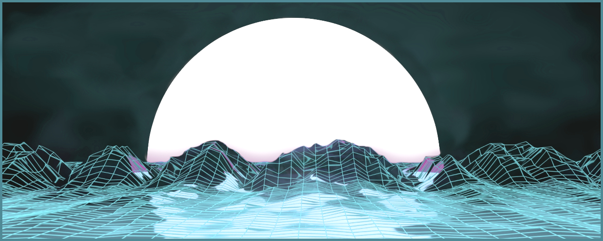

Development
===========

Overview
--------

We develop models and educational resources with an emphasis on openness and easy-of-access. All developed models, resources and tools are open-source, open-access and available for free (mostly MIT or cc-by licensed).

.. The video below is a playful exploration (by S. Mutz) of landscape evolution model output (by P. Eizenhöfer), using Blender 3D for automatic texture generation and the fortran-sdl2 library for visualising and exploring 3D space.

.. .. youtube:: gEP8VmNYnzo

.. toctree::
   :maxdepth: 1
   :hidden:

   sci
   edu
   pub

