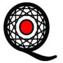

Education Projects
==================

INTEGRATE - Climate Science Teaching Package
--------------------------------------------

INTEGRATE (INTEGRation of Atmospheric science, Technical and Empirical methods) is an open-access, open-source teaching package that covers the topics of physical climatology, empirical methods and a hands-on approach of collecting and analysing atmospheric data. It promotes an interdisciplinary and didactically multifaceted approach to learning about climatology, modern empirical methods and programming. It comprises a crash course in theory and hands-on approach to collecting atmospheric data and working with readily available climatological records on real problems. This course requires no prior knowledge of the topics covered in the course. The following resources are included in the course and packaged into a single `GitHub repository <https://github.com/sebastian-mutz/integrate>`_:
(1) Accessible graphics and notes for learning about climate science. These are divided into chapters („Building a Climate“), which can be taught as a lecture series or studied as a virtual introductory text to physical climatology.
(2) Materials for the exercise series (including solutions to posed problems, data and code) and tested ideas for group projects.
(3) All code required to compile the teaching materials into a complete course website.
The project was supported by the European Geosciences Union and is listed in the `EGU teaching resources <https://www.egu.eu/education/resources/342/integrate-integration-of-atmospheric-science-technical-and-empirical-methods/>`_.

.. seealso::

   A full demonstration and explanation of the teaching package can be found on a compiled version of the course website that is hosted `here <https://integrate.mutz.science>`_.

ParsQuake - Earthquake Education Materials
------------------------------------------

Earthquakes are the pulse of a vibrant and dynamic planet. The livelihood of the Earth can be appreciated through the study of earthquakes and other natural phenomena. With the knowledge we gain from studying earthquakes, we can start to understand and reduce their impact on society. Our earthquake lessons are designed to educate students and teachers with little or no pre-existing knowledge of Earth and space sciences, so that they may protect themselves in the event of an earthquake. Our curriculum consists of pre- and post-assessment activities, six directed inquiry-based science activities describing physical processes related to earthquakes, five interactive activities on earthquake hazards and mitigation strategies, and a codification art/literacy project. Each earthquake hazards lesson includes a Tabletop Exercise, which is a scenario that incorporates the occurrence of a particular type of hazard into a realistic chain of events that a student may experience during an earthquake. All lessons are optimized for scientific content, ease of implementation, appropriateness to the targeted grade levels (middle and high school) and cultural sensitivity. The materials are availble through the `ParsQuake website  <https://parsquake.org/>`_. You can read more about how they were tested `here <https://doi.org/10.5194/gc-4-281-2021>`_ (Mohadjer et al.,2021).

.. seealso::

   The videos, transcripts, supplemental material and news about the initiative can be found `here <https://parsquake.org/>`_.

