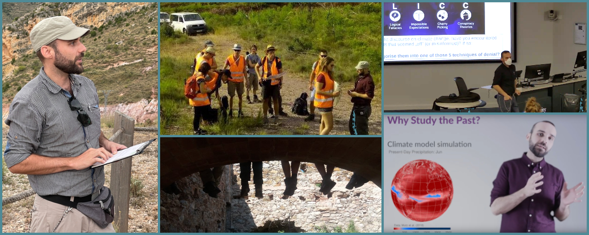

Teaching
========

Overview
--------

Several of us teach in the School of Geographical and Earth Sciences (GES) at the University of Glasgow. This includes Sebastian Mutz (climate physics, statistics and machine learning, multidisciplinary approaches to understanding and tackling climate change), Paul Eizenhöfer (landscape dynamics and computational geoscience), and Karen Cameron (environmental science and related field classes). These and other courses relevant to Climate Dynamics are taught in several of the University of Glasgow :doc:`Degree Programmes <uni>`.

Additionally, several educational resources are uploaded online. These are released under creative commons licenses and free for anyone to access, download and modify. (Some require you to credit the creators if you plan to distribute them further). See the :doc:`Online Courses <onl>` page for more information.

.. toctree::
   :maxdepth: 1
   :hidden:

   edu
   uni
   onl
