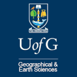

University Programmes
=====================

The School of Geographical and Earth Sciences (GES) at the University of Glasgow offers a number of undergraduate and postgraduate programmes suitable for those interested in tackling the big scientific questions and problems related to environment and climate. Sebastian Mutz is a senior lecturer at GES and teaches climate science, statistics, machine learning and relevant technical skills on different levels.

Undergraduate Programmes
------------------------

See the complete list of degree programmes offered by the School of Geographical and Earth Sciences of the University of Glasgow `here <https://www.gla.ac.uk/schools/ges/undergraduate/>`_.

Postgraduate Taught Degrees
---------------------------

The **"Environmental Futures: Sustainable Systems"** postgraduate taught degree programme provides multidisciplinary knowledge and expertise on the complex and challenging climate-related and environmental issues facing communities across the globe. The programme focuses on the dynamics of the Earth’s surface, atmosphere and hydrosphere, and considers their influence on processes that sustain life at a wide range of spatial and temporal scales.

Sebastian Mutz is currently a convener of **"Environmental Futures: Sustainable Systems"**. For more information, you can consult the `programme website  <https://www.gla.ac.uk/postgraduate/taught/environmentalfuturessustainablesystems/>`_ or get in touch with him!

See the complete list of postgraduate degree programmes offered by the School of Geographical and Earth Sciences of the University of Glasgow `here <https://www.gla.ac.uk/schools/ges/postgraduate/>`_.
