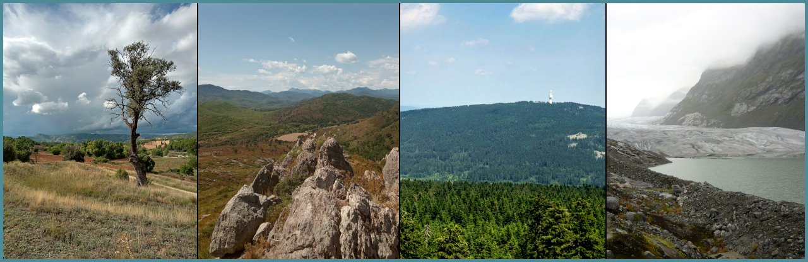

Climate Dynamics Lab
====================

The *Climate Dynamics Lab* (led by Sebastian G. Mutz) focuses on climate and Earth system dynamics, climate change impacts, and the development of methods and tools for research and science communication. It is a small, international network of researchers clustered around specific :doc:`research topics <res/hyp>`. As such, it keeps an open-door policy to anyone working on these topics who shares some core values, namely (a) research integrity and commitment to the pursuit of knowledge, (b) commitment to open science, and (c) respect for peers and community. If you have questions or comments, `get in touch <\sebastian.mutz@glasgow.ac.uk>`_.

.. admonition:: PhD Opportunities: Downscaling and Prediction of Rainfall Extremes (RainX) and More!

   The PhD project RainX will leverage climate modelling and extreme value theory to predict rainfall extremes - one of the grand challenges in climate change impact prediction. The full project description can be found on the ExaGEO website `here <https://www.exageo.org/phd-student-projects/>`_. You will also find other PhD projects there that the *Climate Dynamics Lab* is involved in.

.. hint::

   Information about open positions, supervision, and other opportunities can be found :doc:`here <net/opp>`.

.. toctree::
   :maxdepth: 2
   :hidden:
   :caption: Course Information:
   
   res/res
   dev/dev
   edu/edu
   net/net

