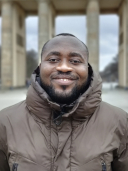
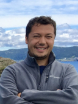
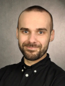

People
======

The *"Climate Dynamics Lab"* is a somewhat non-traditional lab and network of researchers with an open-door policy. The list of people below includes close collaborators with significant and ongoing involvement in the research agenda presented here. If you have any questions or like to join us, `get in touch <\sebastian.mutz@glasgow.ac.uk>`_!

Team Members and Collaborators
------------------------------

.. topic:: Akoto, Doris Kyerewaa (PhD Researcher)

    |ico8|

    - Climate change, atmospheric variability, climate modeling, extreme weather events.
    - University of Glasgow (Scotland, UK)
    - *"I am a PhD student in the ExaGEO programme with a background in Meteorology and Climate Science. My research focuses on climate extremes and atmospheric variability, using high-resolution modeling to improve the prediction of extreme weather events. I am particularly interested in climate hazards in vulnerable regions and how science can inform effective adaptation strategies."*

.. topic:: Ali, Syed Danish (MSc Researcher)

    |ico6|

    - Climate tipping points, oceanography, geology.
    - University of the Basque Country (Spain), visiting scholar at University of Glasgow (Scotland, UK)
    - *"I am interested in analyzing the impacts of climate change on Earth’s systems, a focus that aligns well with my background in Geology and my current master’s studies in Oceanography. I am particularly passionate about identifying and studying tipping elements, as they offer crucial insights into broader systemic changes triggered by abrupt transitions and nonlinear feedbacks. This focus has led me to pursue my master’s thesis on scrutinizing regime shifts in the climatic controls on Norwegian glaciers."*

.. topic:: Boateng, Daniel (Dr. rer. nat., Researcher)

    |ico1|

    - Climate change, Earth surface dynamics, palaeoclimate modelling, AI.
    - University of Tübingen (Germany)

.. topic:: Cameron, Karen (Dr., Senior Lecturer)

    |ico7|

    - Microbial communities in glacial environments
    - University of Glasgow (Scotland, UK)

.. topic:: Castro-Camilo, Daniela (Dr., Senior Lecturer)

    |ico9|

    - Spatial/spatio-temporal extremes, climate extremes attribution, natural hazard and point process modelling
    - University of Glasgow, School of Mathematics and Statistics (Scotland, UK)

.. topic:: Eizenhöfer, Paul (Dr., Senior Lecturer)

    |ico2|

    - Landscape dynamics, numerical modelling, computational geoscience.
    - University of Glasgow (Scotland, UK)

.. topic:: Gross, Eskil Salis (MSc, Doctoral Researcher)

    |ico0|

    - Palaeoclimate and ground temperature profile modelling.
    - GFZ Potsdam (Germany)

.. topic:: Liu, Xiaohui (Dr., Lecturer)

    |ico0|

    - Palaeoclimate reconstructions, sedimentary basins, stratigraphy, oxygen isotopes.
    - China University of Potroleum – Beijing (China)

.. topic:: Meijers, Maud (Dr., Assistant Professor)

    |ico0|

    - Palaeoenvironmental and palaeotopography reconstructions, field and lab based methods.
    - University of Graz (Austria)

.. topic:: Mohadjer, Solmaz (Dr., Academic Associate)

    |ico3|

    - Geohazards, mountain building and erosion, geoscience communication.
    - University of Tübingen (Germany)

.. topic:: Mutz, Sebastian G. (Dr. rer. nat. habil., Senior Lecturer)

    |ico4|

    - Climate change, Earth system dynamics, climate modelling, statistics, AI, computational geoscience.
    - University of Glasgow (Scotland, UK)
    - *"I am a senior lecturer (associate professor) and computational climatologist at the University of Glasgow. I investigate and model climate system dynamics and the regional/local impacts of climate change. I develop and apply statistical tools, data-driven and process-based models. I am an advocate of „open science“ and multilateral collaboration, and an active member of the European Geosciences Union (EGU). I serve as a topical editor for the journals Earth System Dynamics and Geoscience Communication. Recent outreach efforts include the development of open and accessible educational materials about climate science and Earthquakes."*

.. topic:: Peck, Herbert (Don Paloma, Honorary Member)

    |ico5|

    - Pattern and face recognition, path optimisation, behavioural research
    - Free Bird (Freelancer), Glasgow (Scotland, UK)
    - *"Peck, peck ... coo!"*

Former Team Members
-------------------
(List only includes researchers supervised by Mutz. Taught masters are not included.)

- Sedhu-Madhavan, Ardhra (MSc and research assistant)
- Aschauer, Johannes (MSc)
- Bartel, Denise (BSc)
- Behrens, Nicolas (MSc and research assistant)
- Botsyun, Svetlana (Postdoc)
- Geller, Jana (MSc)
- Gnisia, Gregor (BSc)
- Guddeti, Gayathri (MSc)
- Li, Jingmin (Postdoc)
- Muceniece, Ilze (MSc and research assistant)
- Neumann, Annalena (research assistant)
- Poremba, Noam (intern)
- Ring, Simon (MSc and research assistant)
- Seeber, Marie (Msc)
- Salis-Gross, Eskil (Msc)
- Scherrer, Samuel (MSc)
- Sharma, Hemanti (MSc)
- Tettenborn, Judith (BSc)
- Yang, Yuling (MSc)
