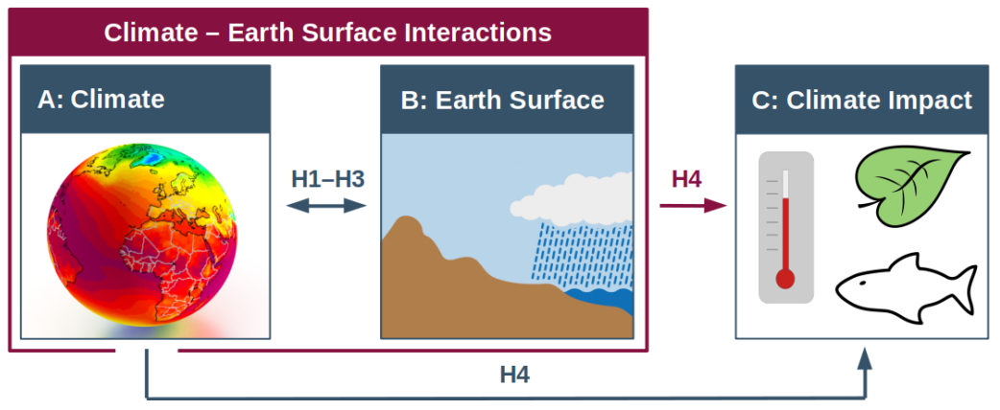

Hypotheses
==========

Research Topics
---------------

Earth’s terrestrial surface is a venue for the interactions between climate and the cryosphere, biosphere, geomorphological and geodynamic processes. The dynamics of this environment shape the boundary conditions for the life of many species, including humans. Here, we focus on the interactions between climate and the other Earth system components. The core topics of this research can be organised into three well-connected categories: A) Climate (Cenozoic, present-day and future), B) Earth surface dynamics, and C) contemporary climate change impact assessments and predictions.

   Primary research topics comprise A) Climatology, B) Earth surface dynamics, and C) climate change impact assessment. A is needed to answer questions of research topic B, and both A and B contribute to C. These connections are based on the broad underlying hypotheses H1-H4.

Research Hypotheses
-------------------

These research topics are linked by several important, broad hypotheses, which can be summarised as follows:

- **Hypothesis 1**: Climate change exerts significant and measurable control on Earth surface systems and processes (incl. glaciers, vegetation, erosion).
- **Hypothesis 2**: Synoptic-scale climate variability can explain much of the variation in terrestrial hydrology and regional near-surface climate.
- **Hypothesis 3**: Changes in Earth surface properties (incl. topography, ice cover, vegetation) result in significant and measurable impacts on regional and global climate.

The societal importance of studying (recent and distant) past climates and Earth surface changes is epitomised by the concept *“The past is the key to the future”*. This can be expressed more elegantly as a 4\ :sup:`th` hypothesis that underlines the socioeconomic relevance and motivations for conducting research in categories A and B:

- **Hypothesis 4**: Earth has already experienced climates similar to potential future climates caused by anthropogenic factors.

