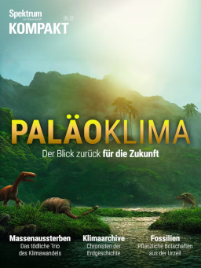
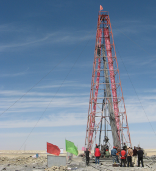

Press
=====

Earth's Climate is not in Equilibrium
-------------------------------------

A piece by Florian Sturm in *Spektrum* (German edition of *Scientific American*) [German]

*"The climate in Earth's history was variable and sometimes extreme. Paleoclimate researcher Sebastian Mutz explains how to decipher the traces of past climate change - and use this to gain insights into the future. The past is the key to the future - especially in climate research. In the past, the Earth's climate was repeatedly characterised by strong fluctuations that made our planet a completely alien world to us. The traces of these climate caprices can be found in ice cores or the finest chemical details of ancient rocks. Paleoclimate researcher Sebastian Mutz explains how experts use these traces to reconstruct the climate of the distant past. These results not only reveal what the climate was like in the various phases of Earth's history, but also how it changed and why. Above all, however, such data helps us to understand what is happening to the Earth's climate in the present and what the alien planet will probably look like in our own future."* Read the full article `here <https://www.spektrum.de/news/palaeoklima-das-erdklima-ist-definitiv-nicht-im-gleichgewicht/2073378>`_.

Lake to Desert to Lake
----------------------
A piece by Wolfgang Krischke published in *Attempto!* [German and English]

*"Driving through the Qaidam basin in the north of the Tibetan plateau, you will encounter an endless desert steppe. Occasionally, the white-encrusted surfaces of salt lakes shimmer. It is hard to imagine that here, in one of the driest regions of China, an immense freshwater lake filled the landscape. But two million years ago a mega lake filled the basin and covered an area of 120,000 square kilometers. Although the area was already becoming drier during this period, the lake still existed for a long time. Only a few hundred thousand years ago did it begin to shrink relentlessly and eventually disappear completely. In terms of the Earth’s lengthy history, that might seem like only yesterday. But how could the lake survive so long instead of its waters evaporating? And is there any chance that there will be a lake here again at some point? Erwin Appel, Professor of Geophysics, and Sebastian Mutz from the Earth System Dynamics research group at the University of Tübingen are working on answering these questions through geological drilling in the Qaidam basin and elaborate computer models."*

:download:`Article download <doc/attempto_AppelMutz.pdf>`

