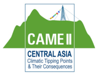
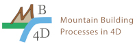
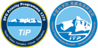
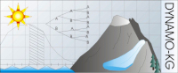

Projects
========

RainX
-----

Many urgent issues related to climate change, such as flooding, mass wasting, and water quality, are closely tied to rainfall extremes. Reliable predictions of extremes are, therefore, critical for risk management. Prediction of extremes, which is one of the main focuses of extreme value theory, is still considered one of the grand challenges by the World Climate Research Programme. This project will address this challenge by developing novel statistical, computationally efficient models that are able to predict rainfall extremes from the output of GPU-optimised climate models. You can find more information `here <https://www.exageo.org/phd-student-projects/>`_.

ExaGEO
------

ExaGEO will deliver the next generation of Earth and environmental scientists trained in exascale computing. ExaGEO is a holistic and multidisciplinary program targeting excellence in both the technical skills required for the development and application of software and multidisciplinary ‘domain’ training in the complexity of simulated Earth system processes. You can find more information `here <https://www.exageo.org>`_.

GECO-21
-------

Glaciers are rich in microorganisms that are specialised to the challenging conditions that they live in; they have crucial roles to play in local nutrient cycling, and global atmospheric and oceanic processes; but almost nothing is known about what happens to glacial microorganisms when they are flushed downstream. GECO-21 (Glacial Ecology Changes in the 21\ :sup:`st` Century) addresses the question "How will glacial environments function when the glaciers are gone?"

CAME II - QTiP
--------------

The BMBF research program “Central Asia: Monsoon dynamics and geoecosystems” and the project “Tipping points in the climate system and their consequences for Central Asia” focus on current research questions in the areas of climate change, geodynamics and georesources (including water) in interdisciplinary projects in international cooperation. An integrative systems approach is pursued here. The joint projects are to be understood as the German contribution to the large international R&D program "Third Pole Environment" (TPE) initiated by China, in which numerous nations are participating. The projects thus complement and integrate ongoing international and national geoscientific research projects in this region.

REAL
----

REAL is part of the priority programme 4DMB (4D Mountain Building) and focuses on reconstructing eastward propagation of surface uplift in the Alps by combining stable isotope palaeoaltimetry and clumped isotope (Δ47) derived temperature reconstructions with isotope-enabled General Circulation Models (GCMs).

EarthShape
----------

The overarching research question of this project is how microorganisms, animals, and plants influence the shape and development of the Earth’s surface over time scales from the present-day to the distant geologic past. EarthShape bridges between scientific disciplines and includes geoscientists and biologists to study this complex question from different viewpoints. Approximately 60 German and 20 Chilean researchers are involved in a diverse range of projects of this priority program

APE
---

The Alps Palaeoelevation/-climate Experiment (APE) is part of the priority programme 4DMB (4D Mountain Building). If focuses on Neogene paleoelevation and paleoclimate of the Central Alps. It aims at linking Earth Surface Processes to Lithospheric Dynamics by applying a novel approach to palaeoaltimetry, utilising climate models and stable isotope palaeoaltimetry.

EXTREME
-------

Tectonic plate corners are hotspots for high rates of continental deformation and erosion, and associated with human-relevant hazards including poorly understood earthquakes, destructive landslides, and extreme climate. A better understanding of continental deformation can mitigate these hazards. However, the coupling between climate and tectonic interactions at plate corners is a key unknown and the focus of this study.

TiP
---

TiP (Tibetan Plateau: Formation, Climate, Ecosystems) quantifies the global and regional climate changes during the uplift of the Tibetan Plateau over periods of thousands of years (e.g. last glaciation) up to geological time scales (50 million years). The experiments provide insights into the environmental changes during the uplift of the Tibetan Plateau and thus form the basis for understanding current and future climate fluctuations in this region.

Dynamo-KG
---------

DYNAMO-KG (Dynamic statistical modelling of glacier mass balance changes in Norway) predicts future glacial mass changes of Scandinavian glaciers through empirical-statistical modelling.
