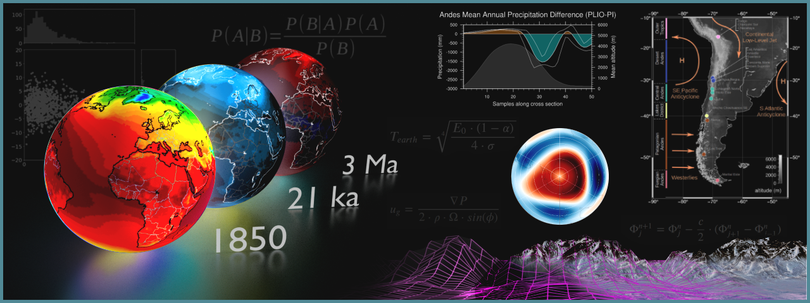

Research
========

Overview
--------

The *Climate Dynamics Lab* tackles research questions in the disciplines of atmospheric science, climate - Earth surface interactions, and climate change impacts. See more details on research topics and hypotheses :doc:`here <hyp>`. These questions are tackled through the development and use of process-based numerical models, empirical models (relying heavily on statistics and machine learning), and the strong integration of meteorological and geological data.

.. toctree::
   :maxdepth: 1
   :hidden:

   hyp
   pro
   pub
   press
